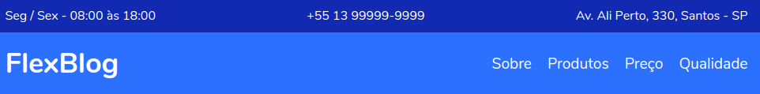

# Flexblog
---

>Este projeto foi criado a partir do curso CSS Flexbox ministrado pelo Designer e Programador André Rafael na plataforma Origamid. Clique na imagem para ser re-direcionado ao site criado. 
---

## Descrição

Este projeto teve como objetivo externar de forma prática os conhecimentos obtidos através do curso citado logo acima, portanto, o mesmo apresenta diversas implementações de features contidas no módulo Flexbox do CSS3 tais como o controle de layout da página, e as facilidades que são trazidas neste módulo para uma adaptação mais fluida da responsividade conforme o redimensionamento da tela. Indo além, foi utilizado javascript para criar uma rolagem mais suave ao clicar nas opções de navegação do menu.

## Tecnologias 

- HTML5
- CSS3
- Javascript
